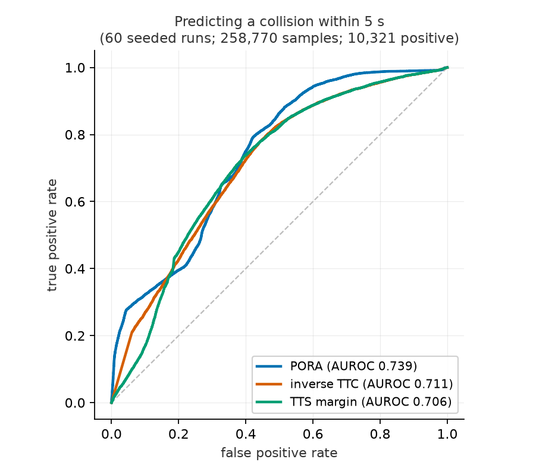
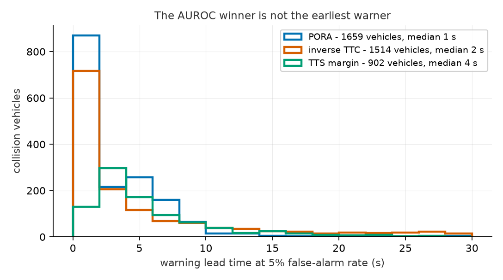

# risk-metric-bench

[](https://github.com/chenggma/risk-metric-bench/actions/workflows/tests.yml)

A **metric-agnostic benchmark** for surrogate safety metrics. The question
it answers is narrow and empirical:

> Given the state of a vehicle and its neighbors at time *t*, how well does
> a risk metric's score predict whether that vehicle is actually involved
> in a collision within the next 5 seconds?

The harness does not care what is being scored. Any function
`(ego, foes) -> float` with "higher = riskier" is a metric. Shipped
adapters:

| Metric | Definition |
|---|---|
| `inv_ttc` | 1 / time-to-collision (disc approximation, capped at 1/0.1 s) |
| `neg_tts_margin` | −(TTC − reaction-and-stop time): how unavoidable the TTC event is |
| `pora` | The PORA metric via [pora-replication](https://github.com/chenggma/pora-replication), on constant-velocity-Gaussian occupancy |

All three see the **same information** - current positions, velocities, and
dimensions - so no metric gets privileged foresight. PORA's occupancy comes
from the same constant-velocity assumption TTC makes; results speak to the
metric under a simple predictor, not to any learned system.

## Design

**Scenario.** A two-road priority intersection in Eclipse SUMO 1.27.1
(pinned): east-west major road, north-south minor road. 30% of minor-road
drivers ignore priority (`jmIgnoreFoeProb`) and 50% of major-road drivers
ignore intruders already in the junction (`jmIgnoreJunctionFoeProb`) -
the "didn't see him" mechanism. This is **deliberately crash-dense** so
that positive labels are plentiful; it is a benchmark scenario, not a
calibrated model of any real intersection. Collisions are logged
(`--collision.action warn`), never teleported away.

**Ground truth.** A sample (vehicle, t) is positive iff that vehicle
appears in a logged collision within (t, t+5 s]. Post-crash samples of
involved vehicles are dropped. Only vehicles within 60 m of the junction
are scored.

**Evaluation.**
* **AUROC** - probability a random positive sample outranks a random
  negative one (Mann-Whitney, average ranks for ties).
* **Median warning lead time** - each metric's alarm threshold is fixed at
  the 95th percentile of its negative-sample scores (5% false-alarm rate);
  lead time is collision time minus first alarm time, per collision
  vehicle.

## Results

60 seeded runs (seeds 1-60, 300 s each): **1,134 logged collisions**,
258,770 scored samples, 10,321 positive (4.0%). Scoring stride 1.0 s.
Full summary committed at `results/full/summary.json`.

| Metric | AUROC | Median lead time @ 5% FPR | Collision vehicles warned |
|---|---|---|---|
| **pora** | **0.739** | 1.0 s | **1,659** |
| inv_ttc | 0.711 | 2.0 s | 1,514 |
| neg_tts_margin | 0.706 | 4.0 s | 902 |





Reading this honestly: PORA separates collision-bound from safe samples
best, and its 5%-FPR alarm reaches the most collision vehicles - but that
alarm fires latest (median 1.0 s before impact). The TTS margin is the
mirror image: the earliest warnings (4.0 s) on the fewest vehicles (902).
**Discrimination and warning timeliness are different questions**, and a
metric can win one while losing the other; a deployment would choose
thresholds for its use case rather than reading AUROC alone.

## Reproduce

```bash
pip install numpy eclipse-sumo==1.27.1
pip install "pora-replication @ git+https://github.com/chenggma/pora-replication"

python -m bench.run      --outdir results/raw --seeds 60 --end 300
python -m bench.evaluate --raw results/raw    --out results/full --stride 2
```

Runs are seeded (seeds 1-60) and SUMO's version is pinned, so the raw XML
is regenerable and is not committed; `results/full/summary.json` is. The
sim phase takes ~15 min, the evaluation ~1 h (PORA dominates at a few ms
per sample).

## Honest limitations

* One scenario family (priority intersection), one vehicle mix. External
  validity beyond right-angle urban conflicts is unestablished here.
* PORA is evaluated on constant-velocity-Gaussian occupancy, not the
  learned predictor of the original paper - by design, but it means these
  numbers do not grade that paper's full system.
* Lead-time granularity is limited by the 1.0 s scoring stride.
* SUMO's collision generation comes from junction-model parameters, not
  from a naturalistic driver model; absolute collision rates are not
  meaningful, only the ranking task built on them.

## Tests

36 SUMO-free unit tests (labeling windows, AUROC hand cases, adapters,
XML parsing, scenario generation); CI on Python 3.9 and 3.12.

```
python -m unittest discover -s tests
```

MIT license.
